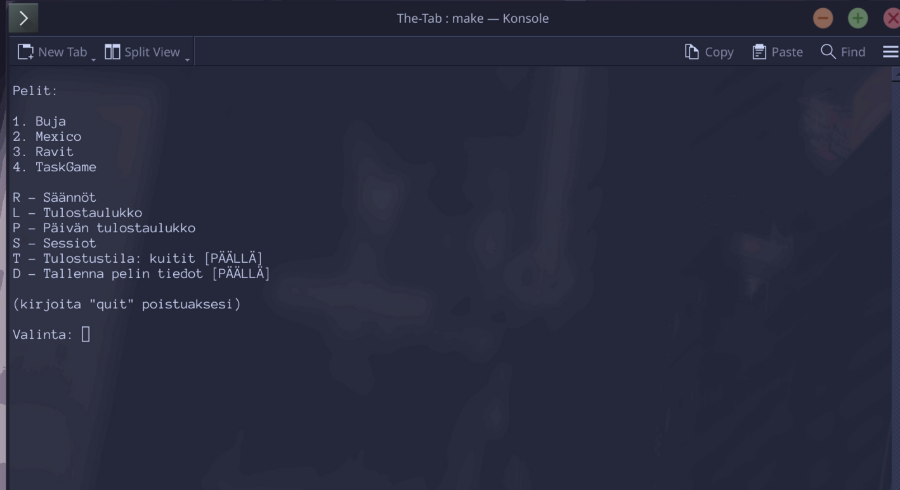
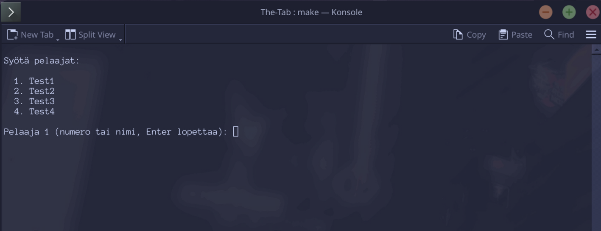
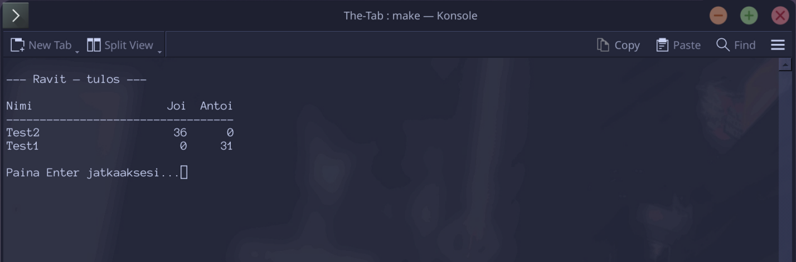
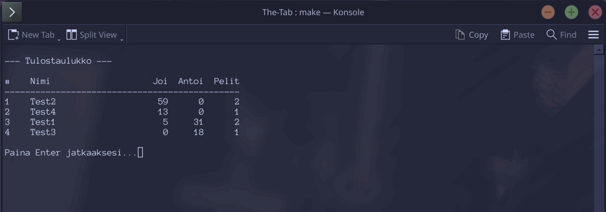
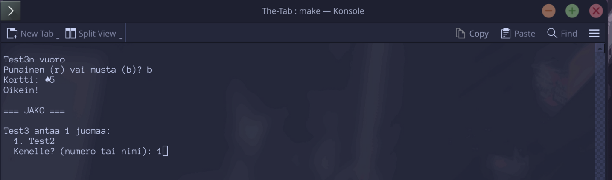
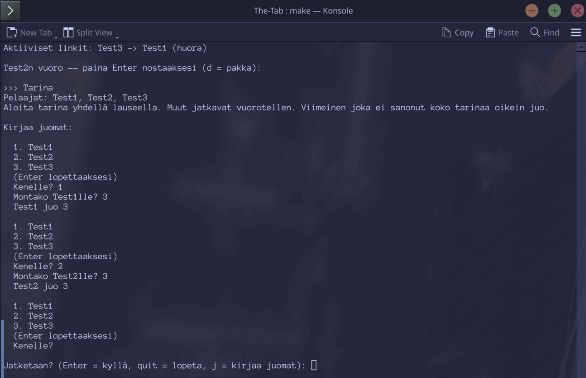
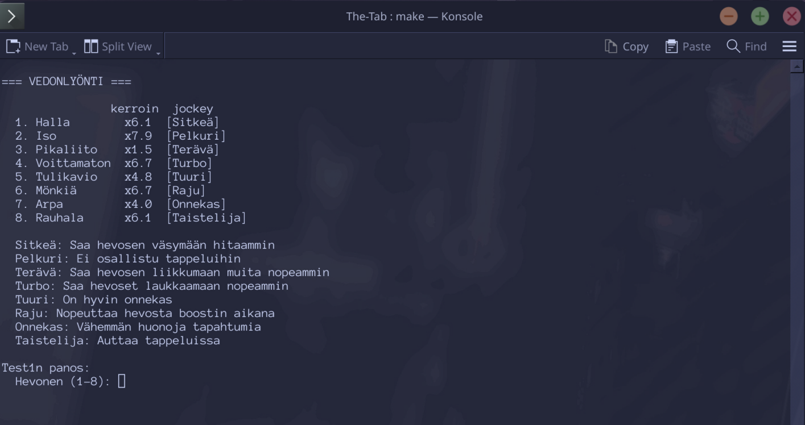
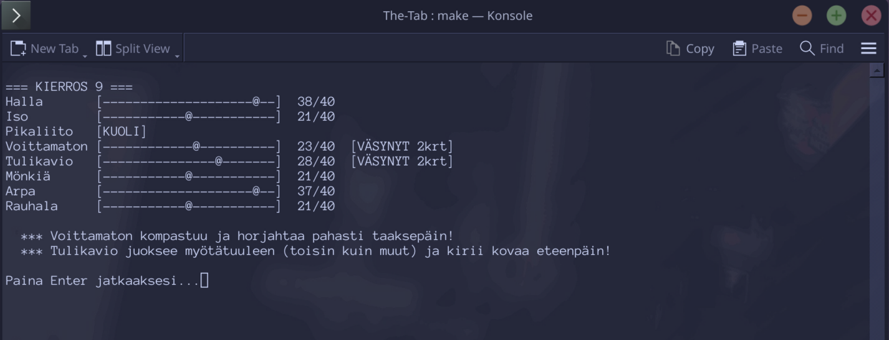
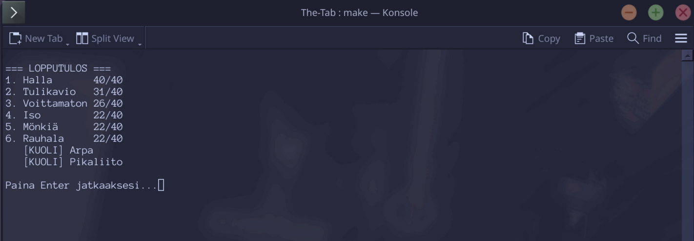

# The-Tab

A CLI drinking game suite that uses a thermal receipt printer to print cards and results during play.



## Requirements

Python 3.10 or newer.

Install dependencies:

```
pip install -r requirements.txt
```

On Windows, also install `pywin32` if you want to use the `win32raw` printer connection:

```
pip install pywin32
```

`pywin32` is Windows-only. On other platforms omit it and use `stdout` as the printer connection.

## Running

```
python main.py
```

Or with make:

```
make run
```

Admin mode (allows deleting players and sessions):

```
make run-admin
```

Debug mode (enables test receipt printing and verbose game output):

```
make run-debug
```

## Testing

```
make test
```

## Configuration

Edit `config.json` to set up the printer and adjust game settings.

**Printer options** (`connection` field):

* `stdout`: prints receipts to terminal, no hardware needed
* `win32raw`: Windows thermal printer over USB; set `printerName` to match your printer

**Printer settings:**

* `receiptWidth`: characters per line (default: 32); adjust to match your printer
* `printerName`: printer name as it appears in Windows (win32raw only)
* `saveImages`: save rendered card images to `output/` folder
* `useCardImages`: render card images using fonts instead of plain text

## Games

  

### Buja

A card guessing game. Players go through four phases:

1. Red or Black
2. Higher or Lower
3. Inside or Outside
4. Suit

Then everyone plays a shared board phase where cards are revealed one by one. Each card has an action (drink, give, or share). Players who have a matching rank in hand must perform the action. The final card is always share and worth double the last row.

**Buja settings** (`config.json`):

* `boardLength`: number of rows in the board phase
* `boardStartDrinks`: drinks on the first board row
* `boardIncrement`: drinks added per row
* `drinkAmount`: drinks for a wrong guess in the phase rounds
* `deckCount`: number of decks to use

Settings can be adjusted before each game from the CLI without editing the config file.



<<<<<<< HEAD
---

### Mexico

A dice bluffing game. Players take turns rolling two dice and announcing a score — truthfully or lying. The next player either accepts the claim and must beat it, or challenges it.

**Scoring:**

* Regular rolls are ranked by their two-digit value (e.g. 65 beats 54)
* Doubles beat all regular rolls (e.g. 33 beats 65)
* Mexico (2-1) is the highest value and beats everything

**On a challenge:**

* If the claimer lied → claimer drinks
* If the claimer told the truth → challenger drinks
* Mexico doubles the drink penalty

**Mexico settings** (`config.json`):

* `drinkAmount`: drinks for a lost challenge (default: 1)
* `mexicoDrinks`: drinks when Mexico is involved in a challenge (default: 2)

Settings can be adjusted before each game from the CLI without editing the config file.

=======
>>>>>>> main
---

### Mexico

A dice bluffing game. Players take turns rolling two dice and announcing a score either truthfully or lying. The next player either accepts the claim and must beat it, or challenges it.

**Scoring:**

* Regular rolls are ranked by their two-digit value (e.g. 65 beats 54)
* Doubles beat all regular rolls (e.g. 33 beats 65)
* Mexico (2-1) is the highest value and beats everything

**On a challenge:**

* If the claimer lied → claimer drinks
* If the claimer told the truth → challenger drinks
* Mexico doubles the drink penalty

**Mexico settings** (`config.json`):

* `drinkAmount`: drinks for a lost challenge (default: 1)
* `mexicoDrinks`: drinks when Mexico is involved in a challenge (default: 2)

Settings can be adjusted before each game from the CLI without editing the config file.

---

### TaskGame

A turn-based task card game. Players take turns drawing a random task from a shuffled deck. Each task tells a player what to do: drink, give drinks, start a social challenge, or create a persistent link between players. The game ends when the deck runs out.

**Task types:**

* `take`: drawer takes a fixed number of drinks
* `give`: drawer gives drinks to a chosen player
* `social`: open-ended challenge; game master logs drinks manually as `Name:N` pairs
* `link`: creates a persistent link (Pari, Huora); linked players share drinks automatically
* `special`: ongoing effect with no immediate drinks (Sääntö, Kysymysmestari, Immunitetti, Tupla)
* `roulette`: sequential pulls with one guaranteed hit; hit player drinks

**During the game:**

* Press `d` at the draw prompt to see how many cards remain.
* Press `q` after any card to quit early and print the tally.

**TaskGame settings** (`config.json`):

* `commonCount`: how many copies of common cards go in the deck (default: 4)
* `specialCount`: how many copies of special/rare cards go in the deck (default: 2)

Settings can be adjusted before each game from the CLI without editing the config file.



---

### Ravit

A horse racing game. Horses with randomised stats race on a tile track while random events fire each round. Players bet drinks on a horse before the race starts.

**Before the race:**

Each horse is assigned a random jockey with a unique bonus. Players pick a horse and bet 1–N drinks on it.

**During the race:**

Each round horses move based on speed with a random roll added. Random events can fire: boosts, motivated sprints, overtakes, stumbles, falls, lightning strikes, drunk fans, and fights between nearby horses. When two horses are within 1 tile of each other there is a chance they start fighting, stalling both for several rounds before one wins and the other dies.

**Finishing:**

If two or more horses cross the finish line within 1 tile of each other a tiebreak fight determines the winner. Combatants have health and strength stats; the last one standing wins.

**Drink resolution:**

* Bettors on a dead or DNF horse drink **double** their bet
* Bettors on the winner give drinks (bet × odds, rounded up) to last-place bettors
* All other bettors drink their bet amount

**Ravit settings** (`config.json`):

* `horseCount`: number of horses in the race (default: 8)
* `trackLength`: tiles to the finish line (default: 40)
* `maxBet`: maximum drinks a player can bet (default: 5)
* `eventChance`: base probability of a random event per horse per round (default: 0.20)
* `fightChance`: probability of a fight starting between two nearby horses (default: 0.05)

Settings can be adjusted before each game from the CLI without editing the config file.

  
